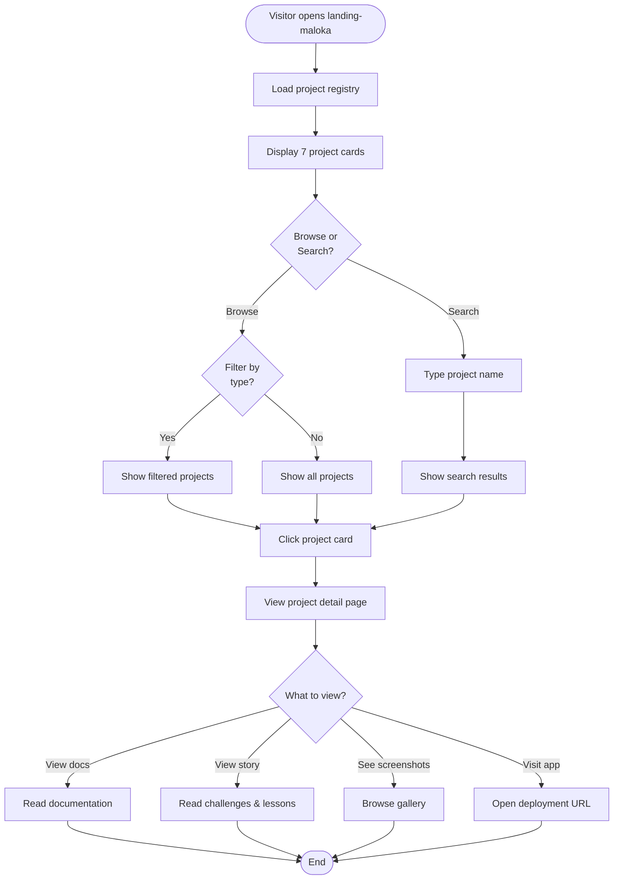

# FRD: Landing Maloka — Personal Engineering Portfolio OS

| Field | Nilai |
|---|---|
| Versi | 2.0 |
| Status | Draft — Checkpoint Review (Lean MVP) |
| Tanggal | 2026-05-21 |
| Author | Claude Code Documentation Factory |
| Linked BRD | 01-BRD-landing-maloka-ecosystem-v1.2.md |

## 1. Pendahuluan

Dokumen ini menjelaskan **functional requirements** untuk landing-maloka MVP — apa yang pengguna dapat lakukan dari sudut pandang UX/value, bukan internal implementation.

### 1.1 Ruang lingkup (Phase 1 MVP)

**In-scope:**
- Project registry & discovery (card grid, filterable)
- Public portfolio showcase dengan project metadata
- Real-time documentation viewer (sync via GitHub webhook)
- Per-document visibility control (public/private)
- Portfolio narrative display (challenges, lessons, innovations)
- AI involvement tracking display
- Artifact gallery (screenshots, demos, links)
- Mobile responsive design

**Out-of-scope (Phase 2+):**
- Monitoring dashboard, uptime tracking, alerts
- Deployment status badges
- Grafana/Portainer integration
- Private dashboard, CI/CD status
- AI analytics, engineering timeline

## 2. Persona pengguna

| ID | Persona | Device | Use case utama |
|---|---|---|---|
| P1 | Portfolio Visitor | Mobile + Desktop | Browse portfolio, see project showcase, read public docs |
| P2 | Project Owner/Engineer | Desktop | Manage projects, update docs, write narratives |
| P3 | Knowledge Seeker | Mobile + Desktop | Search & browse documentation |

## 3. Functional requirements (Phase 1 MVP)

---

### FR-1: Project Registry & Discovery

**Deskripsi:**
Visitor dapat browse semua projects dalam readable registry format dengan filtering & sorting capabilities.

**User story:**
> Sebagai P1 (Portfolio Visitor), saya ingin melihat daftar semua project dalam satu halaman dengan filter options, agar saya bisa explore portfolio dengan mudah.

**Acceptance criteria:**

- **Given** user buka landing-maloka home
- **When** halaman load selesai
- **Then** tampilkan grid/list dengan 7 projects, masing-masing card menampilkan: project name, type, stack badges, short description, deployment URL
- **And** load time < 2 seconds
- **And** card dapat di-filter by project type (WEB_APP, MOBILE_APP, etc)
- **And** card dapat di-sort (Recently updated, Alphabetical, By type)
- **And** design mobile-responsive (looks good on 360px-2560px)

---

### FR-2: Project Detail Page

**Deskripsi:**
Visitor dapat click project card untuk melihat detailed information tentang project — metadata, documentation links, narrative, artifacts.

**User story:**
> Sebagai P1, saya ingin click project card untuk lihat detail, agar saya punya informasi lengkap tentang project tersebut.

**Acceptance criteria:**

- **Given** project card ditampilkan di registry
- **When** user click card
- **Then** navigate ke project detail page menampilkan:
  - Project name, type, lifecycle state (idea/building/active/archived/experimental)
  - Stack: backend, frontend, infrastructure
  - Short description
  - GitHub repository link
  - Deployment/homepage URL
  - Project metadata (created date, last updated)
- **And** load time < 1.5 seconds

---

### FR-3: Documentation Viewer

**Deskripsi:**
Visitor dapat baca project documentation (PRD, ARCHITECTURE, ROADMAP, API, TASK) langsung dari project detail page, dengan docs that render cleanly.

**User story:**
> Sebagai P1 & P3, saya ingin baca documentation di portfolio tanpa perlu pergi ke GitHub, agar saya dapat understand project dengan context yang jelas.

**Acceptance criteria:**

- **Given** user di project detail page
- **When** user click "Documentation" tab
- **Then** display tabs: PRD, ARCHITECTURE, ROADMAP, API, TASK (if available)
- **And** click tab → render markdown sebagai formatted HTML
- **And** markdown rendering support: headings, lists, code blocks (syntax highlighted), tables, links, images (responsive)
- **And** load time per doc < 500ms
- **And** respect document visibility: only show PUBLIC docs (hide PRIVATE)

---

### FR-4: Real-time Documentation Sync

**Deskripsi:**
Documentation updates in repository automatically appear on portfolio shortly after push.

**User story:**
> Sebagai P2 (Engineer), saya ingin documentation update otomatis di portfolio setelah saya push ke GitHub, agar portfolio selalu current. Sebagai P1 (Visitor), saya ingin baca latest docs tanpa manual refresh.

**Acceptance criteria:**

- **Given** engineer push documentation updates ke GitHub repository
- **When** push completes
- **Then** documentation on portfolio updates automatically shortly after
- **And** visitor dapat lihat latest version (no manual refresh needed)
- **And** if update fails: show "Documentation out of sync" warning badge with manual retry button

---

### FR-5: Per-Document Visibility Control

**Deskripsi:**
Engineer dapat control yang docs public (visitor visible) vs private (engineer only, hidden).

**User story:**
> Sebagai P2, saya ingin set document visibility (public/private) untuk flexibility pada sensitive docs, agar saya dapat share publicly what I want.

**Acceptance criteria:**

- **Given** project.config.yaml define documentation visibility
- **When** visitor browse project detail
- **Then** only show documentation dengan visibility "PUBLIC"
- **And** hide documentation dengan visibility "PRIVATE" (no indicator shown to visitors)

---

### FR-6: Project Lifecycle State Display

**Deskripsi:**
Portfolio menampilkan project lifecycle: idea, building, active, archived, experimental — untuk clarity tentang project maturity.

**User story:**
> Sebagai P1, saya ingin tahu status project (active, archived, experimental), agar saya understand project stability dan maturity.

**Acceptance criteria:**

- **Given** project.config.yaml define lifecycle_state
- **When** user view project card atau detail page
- **Then** display lifecycle badge: IDEA (purple), BUILDING (orange), ACTIVE (green), ARCHIVED (gray), EXPERIMENTAL (blue)
- **And** tooltip explain meaning dari each state

---

### FR-7: Portfolio Narrative & Storytelling

**Deskripsi:**
Portfolio showcase project story — challenges, lessons learned, innovations. Transform dari "cold technical archive" ke "human engineering journey".

**User story:**
> Sebagai P1, saya ingin baca cerita di balik setiap project — what challenges, what was learned — agar portfolio terasa lebih human dan relatable.

**Acceptance criteria:**

- **Given** project.config.yaml have portfolio_narrative fields
- **When** user view project detail page
- **Then** display "Project Story" section:
  - **Portfolio Narrative** (1-2 paragraphs): high-level story
  - **Challenges** (bulleted): 2-5 challenges faced
  - **Lessons Learned** (bulleted): 2-5 key lessons
  - **Innovations** (bulleted): 2-5 innovations or unique approaches
- **And** if field empty: show "No story shared yet" gracefully

---

### FR-8: AI Involvement Tracking

**Deskripsi:**
Portfolio showcase yang aspects of project used AI assistance — documentation, architecture, testing, refactoring, deployment. Differentiator untuk AI-native engineering.

**User story:**
> Sebagai P2, saya ingin portfolio showcase which aspects used AI assistance, agar saya showcase AI-native workflow sebagai differentiator. Sebagai P1, saya ingin understand engineer's approach dengan AI.

**Acceptance criteria:**

- **Given** project.config.yaml define ai_assisted array + score
- **When** user view project detail
- **Then** display "AI Involvement" section:
  - Tags: "AI-Assisted Documentation", "AI Architecture", "AI Testing", "AI Refactoring", "AI Deployment"
  - Progress bar: "70% AI-assisted" (optional score)
  - Brief description of how AI was used
- **And** if score 0: show "Not AI-assisted" gracefully

---

### FR-9: Artifact Gallery

**Deskripsi:**
Portfolio menampilkan project screenshots, demos, APK links, atau artifacts — visual showcase capabilities.

**User story:**
> Sebagai P1, saya ingin lihat screenshots/demos dari aplikasi Anda, agar saya bisa visualize hasil kerja Anda sebelum visit live URL.

**Acceptance criteria:**

- **Given** project.config.yaml reference artifacts
- **When** user view project detail
- **Then** display "Gallery" section dengan thumbnail grid
- **And** click thumbnail → open lightbox dengan full-size image
- **And** support 3-10 screenshots per project
- **And** for mobile apps: show "Download" links (APK, Play Store, App Store if applicable)

---

## 4. User flow

### Main user flow: Visit & Browse Portfolio

---

## 5. Non-functional requirement

| Aspek | Target | Note |
|---|---|---|
| Home page load | < 2 seconds | Cache-friendly |
| Project detail load | < 1.5 seconds | Dynamic rendering |
| Doc render | < 500ms per doc | Markdown → HTML |
| Doc sync latency | < 5 seconds | Webhook to display |
| Mobile responsive | 360px-2560px | All devices |
| Availability | 24/7 acceptable | Home server scale |
| Concurrent users | 50-100 | Low traffic |

---

## 6. Asumsi yang dibuat

- ✅ `project.config.yaml` di setiap repo sudah atau akan disetup per standard
- ✅ Engineer willing maintain metadata & narrative per project
- ✅ GitHub webhook endpoint reachable dari GitHub
- ✅ Visitor traffic volume rendah
- ✅ Documentation size reasonable (< 10MB per file)

---

## 7. Open questions

- [ ] Search functionality: basic string match atau advanced filters (Phase 2)? — @engineer — target Week 1
- [ ] Project relationship/dependencies: should display related projects? — @engineer — target Phase 2+
- [ ] Advanced sort options (by date, by tech stack)? — @engineer — target Phase 2+

---

## Document history

| Versi | Tanggal | Change |
|---|---|---|
| 1.0 | 2026-05-21 | Initial FRD (over-engineered) |
| 2.0 | 2026-05-21 | **Lean MVP Revision** — user-centric focus, removed implementation details, removed monitoring/alerts, focused on portfolio + docs |
