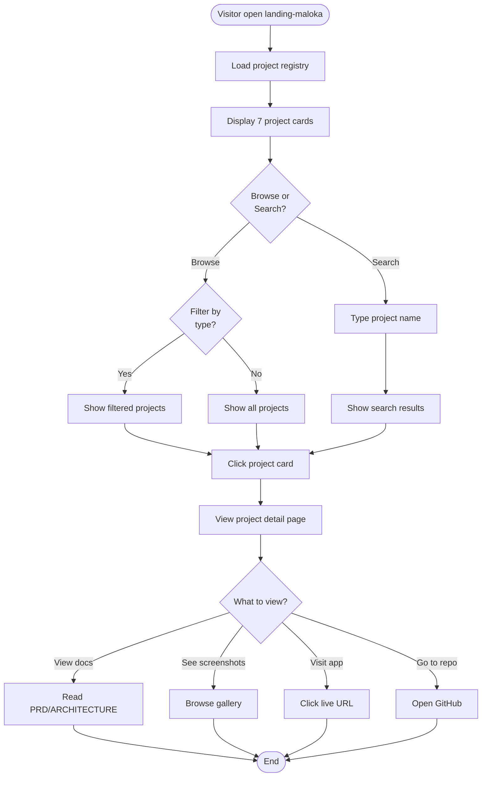

# FRD: Landing Maloka — Unified Engineering Ecosystem Registry

| Field | Nilai |
|---|---|
| Versi | 1.0 |
| Status | Draft — Checkpoint Review |
| Tanggal | 2026-05-21 |
| Author | Claude Code Documentation Factory |
| Linked BRD | 01-BRD-landing-maloka-ecosystem.md |


## 1. Pendahuluan

### 1.1 Tujuan dokumen

Dokumen ini menjelaskan **functional requirements** untuk landing-maloka — apa yang sistem harus bisa lakukan dari sudut pandang pengguna, dengan acceptance criteria konkret untuk setiap fitur.

### 1.2 Ruang lingkup (Phase 1 MVP)

**In-scope:**
- Project registry UI (card-based, filterable)
- Public portfolio showcase dengan project metadata
- GitHub webhook integration untuk real-time doc sync
- Markdown documentation viewer (render PRD, ARCHITECTURE, ROADMAP dari repository)
- Per-document visibility control (public/private)
- Project lifecycle state display (idea/building/active/archived/experimental)
- Project type & deployment type display
- Portfolio narrative display (lessons_learned, challenges, innovations)
- AI involvement tracking display

**Out-of-scope (Phase 2+):**
- Private monitoring dashboard (Phase 2)
- Uptime monitoring widgets (Phase 2)
- Deployment status real-time (Phase 2)
- AI analytics dashboard (Phase 3)
- Advanced search & filtering (Phase 2+)

### 1.3 Definisi & terminologi

| Istilah | Arti |
|---|---|
| Project | Aplikasi, service, atau sistem yang terdokumentasi di registry |
| Project Type | Kategori: WEB_APP, MOBILE_APP, API_SERVICE, IOT_SYSTEM, AI_TOOL, AUTOMATION, INTERNAL_TOOL, EXPERIMENTAL |
| Deployment Type | Model deployment: STATIC, DOCKER, APK, PLAYSTORE, APPSTORE, EDGE_DEVICE, LOCAL_RUNTIME |
| Lifecycle State | Status project: idea, building, active, archived, experimental |
| Documentation | Markdown file (PRD.md, ARCHITECTURE.md, ROADMAP.md, API.md, TASK.md) di repository docs/ folder |
| Portfolio Narrative | Metadata storytelling: lessons_learned, challenges, innovations, portfolio_narrative |
| AI Involvement | Track penggunaan AI dalam: documentation, architecture, testing, refactoring, deployment |
| Artifact | Screenshot, APK, demo, build output, release binary disimpan di MinIO |


## 2. Persona pengguna

### 2.1 Daftar persona

| ID | Persona | Device | Tingkat akses | Use case utama |
|---|---|---|---|---|
| P1 | Portfolio Visitor | Mobile + Desktop | Read-only public | Browse portfolio, lihat project showcase, baca public docs |
| P2 | Project Owner/Engineer | Desktop | Full (owner only) | Manage projects, monitor deployment, update docs |
| P3 | AI Workflow User | Desktop | Read + trigger | Generate docs via Claude Skills, trigger deployment |
| P4 | Knowledge Seeker | Mobile + Desktop | Read-only public | Search & browse project documentation |
| P5 | Deployment Monitor | Desktop | Read-only private (internal) | Monitor deployment status, check health logs |
| P6 | Mobile Developer | Mobile | Read-only public | View mobile app projects, check APK/AppStore links |
| P7 | Internal Dashboard User | Desktop | Read + execute (owner) | Monitor ecosystem health, trigger alerts, manage artifacts |

### 2.2 Detail persona

**P1: Portfolio Visitor (Primary external persona)**
- Device: Mobile (60%), Desktop (40%)
- Frekuensi: Occasional (visit when interested in your work)
- Tech savvy: Medium-high
- Goal: Understand your engineering capability, project portfolio, tech stack
- Use cases:
  1. Browse all 7+ projects di halaman utama
  2. Filter projects by type (web app, mobile, AI tool, etc)
  3. View project card: name, stack, status, short description, deployment URL
  4. Read public documentation (PRD, ARCHITECTURE)
  5. Check project status badge (active, archived, experimental)

**P2: Project Owner/Engineer (You)**
- Device: Desktop
- Frekuensi: Daily
- Tech savvy: High
- Goal: Central hub untuk manage & showcase engineering work
- Use cases:
  1. Create/update project metadata via `project.config.yaml`
  2. Push code → trigger automatic doc sync
  3. Monitor all project deployment status
  4. Edit portfolio narrative (challenges, lessons learned)
  5. Manage AI involvement tracking per project
  6. View private monitoring dashboard (Phase 2)

**P3: AI Workflow User**
- Device: Desktop
- Frekuensi: Weekly
- Tech savvy: High
- Goal: Use AI tools (Claude Skills) to auto-generate docs, maintain consistency
- Use cases:
  1. Trigger Claude Skills to generate PRD/ARCHITECTURE
  2. Webhook auto-sync generated docs to landing-maloka
  3. Verify docs rendered correctly on dashboard
  4. Update AI involvement score when docs generated


## 3. Functional requirements (Phase 1 MVP)

---

### FR-1: Project Registry & Discovery

**ID:** FR-1
**Modul:** Core / Project Management
**Persona:** P1, P2, P4, P6
**Prioritas:** Must

**Deskripsi:**
Sistem harus menampilkan daftar semua projects dalam format registry yang dapat dijelajahi. Setiap project ditampilkan dengan metadata lengkap dari `project.config.yaml`. Visitor dapat melihat status, stack, jenis project, dan link ke deployment.

**User story:**
> Sebagai P1 (Portfolio Visitor), saya ingin melihat daftar semua project Anda dalam satu halaman, agar saya bisa memahami portfolio engineering Anda secara komprehensif.

**Acceptance criteria:**

*Skenario 1 — Display project list*
- **Given** user buka landing-maloka home page
- **When** halaman load selesai
- **Then** sistem menampilkan grid/list dengan 7 project cards
- **And** setiap card menampilkan: project name, type icon, stack badges, status badge, short description, URL
- **And** cards ter-load dalam < 2 detik

*Skenario 2 — Filter by project type*
- **Given** user di project registry page
- **When** user klik filter "WEB_APP"
- **Then** hanya project dengan type WEB_APP ditampilkan
- **And** filter status tetap visible di UI, bisa di-clear

*Skenario 3 — Sort projects*
- **Given** project list ditampilkan
- **When** user klik sort "Recently updated"
- **Then** project ter-sort berdasarkan last update timestamp
- **And** sort options: "Recently updated", "Alphabetical", "By type"

**Dependencies:**
- FR-2 (Project metadata loading)
- Backend API: GET /api/projects

**Notes:**
- Projects ditarik dari GitHub via webhook + local cache
- Status badge: active (green), building (yellow), archived (gray), experimental (blue), idea (purple)

---

### FR-2: Project Metadata Loading from `project.config.yaml`

**ID:** FR-2
**Modul:** Data / Integration
**Persona:** P2, P3
**Prioritas:** Must

**Deskripsi:**
Sistem harus membaca `project.config.yaml` dari setiap repository dan menggunakan data tersebut untuk populate project registry, dokumentasi, dan monitoring dashboard.

**User story:**
> Sebagai P2 (Project Owner), saya ingin metadata project terbaca otomatis dari `project.config.yaml` di setiap repository, agar saya tidak perlu maintain data di dua tempat.

**Acceptance criteria:**

*Skenario 1 — Initial project index*
- **Given** system initialized dengan 7 GitHub repositories
- **When** sistem run indexing (manual trigger atau scheduled)
- **Then** sistem fetch `project.config.yaml` dari setiap repo
- **And** data ter-parse (name, type, stack, deployment_type, documentation path, ai_assisted array, portfolio_narrative)
- **And** 7/7 projects ter-load ke local cache/DB

*Skenario 2 — Metadata validation*
- **Given** `project.config.yaml` fetched dari repository
- **When** sistem parse file
- **Then** if required fields missing (name, type, deployment_type), log warning
- **And** if documentation path invalid, mark as `DOCS_MISSING`
- **And** project tetap ter-index dengan partial data

*Skenario 3 — Update on webhook*
- **Given** developer push ke repository
- **When** GitHub webhook trigger landing-maloka `/webhook/github`
- **Then** sistem fetch latest `project.config.yaml`
- **And** update project metadata dalam < 10 detik
- **And** cache invalidate untuk UI render ulang

**Dependencies:**
- FR-1 (Project Registry display)
- Backend API: POST /api/webhook/github, GET /api/projects/{id}

**Notes:**
- Schema validation untuk `project.config.yaml` menggunakan schema.yaml atau zod/joi validator
- Retry 3x jika fetch gagal; mark status `SYNC_WARNING` kalau gagal terus

---

### FR-3: Public Portfolio Showcase

**ID:** FR-3
**Modul:** UI / Portfolio
**Persona:** P1, P4, P6
**Prioritas:** Must

**Deskripsi:**
Sistem menampilkan portfolio showcase yang impressive untuk external visitors — project cards, stack visualization, deployment status preview, dan direct links.

**User story:**
> Sebagai P1 (Visitor), saya ingin lihat portfolio yang impressive dengan project cards yang informatif, agar saya bisa mengerti engineering capability Anda.

**Acceptance criteria:**

*Skenario 1 — Project card detail*
- **Given** project card ditampilkan di registry
- **When** user hover/expand card
- **Then** card menampilkan:
  - Project name (bold, large)
  - Status badge (ACTIVE, BUILDING, ARCHIVED, EXPERIMENTAL)
  - Type badge (WEB_APP, MOBILE_APP, API_SERVICE, dll)
  - Deployment type badge (DOCKER, STATIC, APK, dll)
  - Stack list (backend, frontend, infrastructure)
  - Short description
  - Live URL link (jika ada)
  - GitHub repo link
  - Last updated timestamp

*Skenario 2 — View project detail page*
- **Given** user klik project card
- **When** navigate ke `/projects/{project-id}`
- **Then** sistem display project detail page dengan:
  - Project name, type, status, deployment URL
  - Full stack breakdown
  - Lifecycle state (idea → building → active)
  - Portfolio narrative: challenges, lessons learned, innovations
  - AI involvement: list tags (documentation, architecture, etc) + score
  - Documentation tabs: PRD, ARCHITECTURE, ROADMAP, API (jika ada)
  - Screenshots/artifacts gallery
  - Link to GitHub repository

*Skenario 3 — Responsive design*
- **Given** user di mobile device (width < 768px)
- **When** view portfolio showcase
- **Then** layout switch to single-column
- **And** cards stack vertically
- **And** font size readable (>16px minimum)
- **And** touch-friendly buttons (>44px minimum)

**Dependencies:**
- FR-1 (Project Registry)
- FR-2 (Metadata loading)
- FR-4 (Documentation viewer)

---

### FR-4: Real-time Documentation Sync & Viewer

**ID:** FR-4
**Modul:** Documentation / Integration
**Persona:** P2, P3, P1, P4
**Prioritas:** Must

**Deskripsi:**
Sistem mengamati push event ke repository, fetch dokumentasi terbaru dari `docs/` folder, dan render Markdown langsung di dashboard tanpa manual copy-paste.

**User story:**
> Sebagai P3 (AI Workflow User), saya ingin dokumentasi (PRD, ARCHITECTURE) yang di-generate oleh Claude langsung ter-sync ke landing-maloka saat saya push ke repository, agar portfolio selalu updated.

**Acceptance criteria:**

*Skenario 1 — GitHub webhook trigger*
- **Given** developer push commit dengan update di `docs/PRD.md`
- **When** GitHub webhook fire
- **Then** landing-maloka receive webhook payload
- **And** parse repo + branch + file changes
- **And** if docs/ file changed, fetch latest content dari GitHub API
- **And** update document metadata + content

*Skenario 2 — Markdown rendering*
- **Given** documentation fetched dari repository
- **When** user view project detail page → PRD tab
- **Then** sistem render PRD.md sebagai formatted HTML
- **And** preserve: headings, lists, code blocks, tables, links, images
- **And** syntax highlight untuk code blocks
- **And** make images responsive (max-width: 100%)
- **And** load time < 1 second

*Skenario 3 — Per-document visibility*
- **Given** `project.config.yaml` define documentation visibility
- **When** user (P1/P4) browse project detail
- **Then** hanya tampilkan documentation dengan visibility `PUBLIC`
- **And** hide documentation dengan visibility `PRIVATE`
- **And** show visual indicator "This doc is private"

*Skenario 4 — Documentation sync failure handling*
- **Given** webhook received untuk doc sync
- **When** fetch dari GitHub gagal (timeout, 404, network error)
- **Then** retry 3x dengan backoff (10s, 1m, 5m)
- **And** log failure detail
- **And** project status badge show `SYNC_WARNING`
- **And** display: "Documentation out of sync, last update XX ago"
- **And** provide manual "Retry sync" button untuk engineer

**Dependencies:**
- FR-2 (Metadata loading)
- Backend API: POST /api/webhook/github, GET /api/projects/{id}/docs/{docname}
- GitHub API (read repo content)

**Notes:**
- Supported doc formats: PRD, ARCHITECTURE, ROADMAP, API, TASK (defined di project.config.yaml)
- Support for markdown + MDX jika future perlu interaktif

---

### FR-5: Project Lifecycle State Display

**ID:** FR-5
**Modul:** Portfolio / Data
**Persona:** P1, P2, P4
**Prioritas:** Should

**Deskripsi:**
Setiap project menampilkan lifecycle state yang menunjukkan maturity — dari ide awal hingga production active atau archived.

**User story:**
> Sebagai P1 (Visitor), saya ingin tahu project mana yang masih experimental vs production active, agar saya mengerti maturity dan stability masing-masing project.

**Acceptance criteria:**

*Skenario 1 — Lifecycle state badge*
- **Given** project ditampilkan di registry
- **When** badge lifecycle state visible
- **Then** badge menampilkan: IDEA (purple), BUILDING (orange), ACTIVE (green), ARCHIVED (gray), EXPERIMENTAL (blue)
- **And** tooltip menjelaskan meaning dari setiap state

*Skenario 2 — Lifecycle journey*
- **Given** user lihat project detail page
- **When** scroll to portfolio narrative section
- **Then** display "Project lifecycle" dengan timeline:
  - Created date: IDEA
  - First release date: BUILDING
  - Production date: ACTIVE
  - Archived date (jika ada): ARCHIVED
- **And** show milestone events

**Dependencies:**
- FR-2 (Metadata loading — source dari project.config.yaml)

---

### FR-6: AI Involvement Tracking Display

**ID:** FR-6
**Modul:** Portfolio / AI Tracking
**Persona:** P1, P2, P3, P4
**Prioritas:** Should

**Deskripsi:**
Sistem menampilkan mana fitur/aspek project yang dikerjakan dengan bantuan AI (documentation generation, architecture design, testing, refactoring, deployment automation). Ini showcase unik positioning Anda sebagai AI-native engineer.

**User story:**
> Sebagai P2 (Engineer), saya ingin portfolio menampilkan project mana yang di-assist AI, beserta AI involvement score, agar showcasing menjadi differentiator.

**Acceptance criteria:**

*Skenario 1 — AI involvement tags*
- **Given** project detail page ditampilkan
- **When** view "AI Involvement" section
- **Then** display tags: `AI-Assisted Documentation`, `AI Architecture`, `AI Testing`, `AI Refactoring`, `AI Deployment`
- **And** hanya tampilkan tag yang ada di `ai_assisted` array di project.config.yaml

*Skenario 2 — AI involvement score*
- **Given** project.config.yaml define `ai_involvement_score: 70`
- **When** user view project detail
- **Then** display progress bar: "70% AI-assisted"
- **And** tooltip: "Documentation (100%), Architecture (50%), Testing (100%), Refactoring (0%), Deployment (100%)"

*Skenario 3 — AI contribution highlight*
- **Given** project punya AI involvement
- **When** user view portfolio narrative
- **Then** highlight section "AI Contributions":
  - "Documentation: Generated using Claude AI PRD template"
  - "Architecture: Designed with AI architectural review"
  - "Testing: Test cases generated, then refined manually"

**Dependencies:**
- FR-2 (Metadata loading)

---

### FR-7: Portfolio Narrative & Storytelling

**ID:** FR-7
**Modul:** Portfolio / Narrative
**Persona:** P1, P2, P4
**Prioritas:** Should

**Deskripsi:**
Beyond technical specs, portfolio harus jadi storytelling engineering journey — challenges faced, lessons learned, innovations, experimental learnings.

**User story:**
> Sebagai P1 (Visitor), saya ingin baca cerita di balik setiap project — challenges, apa yang Anda learn, innovation yang dicapai — agar portfolio terasa lebih human dan credible.

**Acceptance criteria:**

*Skenario 1 — Portfolio narrative fields*
- **Given** project.config.yaml have portfolio_narrative + challenges + lessons_learned + innovations
- **When** user view project detail page
- **Then** display section "Project Story":
  - **Portfolio Narrative** (1-2 paragraf): "This is the first AI-assisted project in my portfolio..."
  - **Challenges** (bulleted): "Initial deployment complexity...", "Metadata consistency across repos..."
  - **Lessons Learned** (bulleted): "Containerization essential for multi-environment..."
  - **Innovations** (bulleted): "AI-assisted database schema design...", "Automated deployment via GitHub Actions..."

*Skenario 2 — Narrative markdown support*
- **Given** challenge/lesson/innovation bisa lebih dari satu kalimat
- **When** render narrative section
- **Then** support markdown formatting (bold, links, code snippet)
- **And** render cleanly dengan line spacing

*Skenario 3 — Optional narrative*
- **Given** beberapa project belum punya narrative
- **When** narrative field kosong
- **Then** section tetap tampil tapi show: "No story shared yet"
- **And** give engineer option di private dashboard to add story

**Dependencies:**
- FR-2 (Metadata loading)

---

### FR-8: Artifact Gallery (Screenshots & Demos)

**ID:** FR-8
**Modul:** Portfolio / Artifacts
**Persona:** P1, P2, P4, P6
**Prioritas:** Should

**Deskripsi:**
Project dapat menampilkan screenshot, demo GIF, APK link, atau artifacts lainnya untuk showcase UI/UX, functionality, dan deployment.

**User story:**
> Sebagai P1 (Visitor), saya ingin lihat screenshot atau demo dari aplikasi Anda, agar saya bisa lihat hasil kerja Anda secara visual sebelum kunjungi live URL.

**Acceptance criteria:**

*Skenario 1 — Screenshot gallery*
- **Given** project.config.yaml reference artifacts directory
- **When** user view project detail page
- **Then** display "Gallery" section dengan thumbnail grid
- **And** thumbnail link ke MinIO artifact storage
- **And** click thumbnail → open lightbox dengan full size image
- **And** support multiple screenshots (3-10)

*Skenario 2 — Mobile app artifacts*
- **Given** project type = MOBILE_APP
- **When** project detail page displayed
- **Then** show "Download" section:
  - APK link (jika deployment type APK)
  - Google Play Store link (jika deployment type PLAYSTORE)
  - Apple App Store link (jika deployment type APPSTORE)

*Skenario 3 — Artifact upload (Phase 2 feature)*
- **Given** engineer login ke private dashboard
- **When** engineer klik "Upload artifact"
- **Then** file upload ke MinIO
- **And** artifact indexed di project metadata
- **And** public portfolio auto-refresh gallery

**Dependencies:**
- FR-2 (Metadata loading)
- MinIO storage backend
- Backend API: GET /api/projects/{id}/artifacts, POST /api/artifacts/upload

**Notes:**
- Phase 1: Static artifacts referenced dari GitHub
- Phase 2: Direct MinIO upload UI

---

## 4. User flow

### 4.1 Visitor Portfolio Browse Flow



### 4.2 Engineer Documentation Sync Flow

```mermaid
flowchart LR
    Dev[Engineer commit] -->|git push| Repo[GitHub Repository]
    Repo -->|webhook trigger| Webhook[landing-maloka Webhook]
    Webhook -->|fetch latest| Config[Read project.config.yaml]
    Config -->|validate| Validate{Valid?}
    
    Validate -->|No| Fail[Log error, status SYNC_WARNING]
    Validate -->|Yes| Fetch[Fetch docs/ from repo]
    
    Fetch -->|parse markdown| Render[Render HTML]
    Render -->|cache| Cache[Update cache]
    Cache -->|notify UI| UI[Project detail page refreshes]
    
    Fail --> Retry[Retry logic 3x]
    Retry -->|success| Cache
    Retry -->|fail| Fail
    
    UI -->|user refreshes| Display[Show updated docs]
    Display --> End([End])
```



---

## 5. Wireframe / Mockup (Text description)

**Screen 1: Home / Project Registry**

```
┌─────────────────────────────────────────┐
│  🏠 Landing Maloka   [AI-Native]        │
│  Personal Engineering Ecosystem         │
├─────────────────────────────────────────┤
│                                         │
│  Filter: [All] [Web App] [Mobile] ...   │
│  Sort: [Updated] [Name] [Type]          │
│                                         │
│  ┌──────────────┐  ┌──────────────┐    │
│  │ RIMS         │  │ landing-istimewa │
│  │ [WEB_APP]    │  │ [WEB_APP]    │
│  │ DOCKER • ✅  │  │ DOCKER • ✅  │
│  │ Laravel, Vue │  │ Next.js      │
│  │ @dashboard   │  │ @app-name    │
│  └──────────────┘  └──────────────┘
│                                         │
│  ┌──────────────┐  ┌──────────────┐    │
│  │ Lasem-tour   │  │ ESP32-Hydro  │
│  │ [WEB_APP]    │  │ [IOT_SYSTEM] │
│  │ DOCKER • ✅  │  │ EDGE • ⚠️    │
│  │ Laravel, Php │  │ Arduino, MQTT│
│  └──────────────┘  └──────────────┘    │
│                                         │
└─────────────────────────────────────────┘
```

**Screen 2: Project Detail**

```
┌─────────────────────────────────────┐
│ < RIMS                              │
├─────────────────────────────────────┤
│                                     │
│ 🟢 ACTIVE  |  WEB_APP  |  DOCKER    │
│ Real-time Inventory Management     │
│                                     │
│ Stack: Laravel, Vue, MySQL, Docker  │
│ 🔗 https://rims.maloka.app          │
│ 📚 GitHub: github.com/user/rims     │
│                                     │
│ ┌─────────────────────────────────┐ │
│ │ Project Story                   │ │
│ │                                 │ │
│ │ First major production system... │ │
│ │                                 │ │
│ │ Challenges:                     │ │
│ │ • Initial deployment complexity │ │
│ │ • Multi-environment testing     │ │
│ │                                 │ │
│ │ Lessons Learned:                │ │
│ │ • Docker essential              │ │
│ │ • AI tests catch edge cases     │ │
│ └─────────────────────────────────┘ │
│                                     │
│ AI Involvement: 70%                 │
│ ✓ Documentation ✓ Architecture       │
│ ✓ Testing      ✓ Refactoring        │
│                                     │
│ [📄 PRD]  [🏗 ARCH]  [📋 ROADMAP]  │
│                                     │
│ Gallery:                            │
│ [screenshot1] [screenshot2]         │
│                                     │
└─────────────────────────────────────┘
```

---

## 6. Non-functional requirement

### 6.1 Performance

| Aspek | Target |
|---|---|
| Home page load time | < 2 seconds |
| Project detail page load | < 1.5 seconds |
| Documentation render | < 500ms |
| Filter/sort action | < 200ms |
| Webhook processing | < 5 seconds |

### 6.2 Availability

- **Portfolio public area**: 24/7 uptime (99.5%+)
- **Maintenance window**: None scheduled (home server operation)
- **Graceful degradation**: Docs cache fallback jika sync gagal

### 6.3 Scalability

- **MVP scale (Phase 1)**: 7 projects, < 1k daily visitors
- **Future scale (Phase 2)**: 20+ projects, < 5k daily visitors
- **Architecture support**: No redesign needed untuk 20+ projects

### 6.4 Security

- **Public area**: No authentication required
- **Private dashboard (Phase 2)**: GitHub OAuth login
- **Data protection**: No PII atau sensitive data di public portfolio
- **CORS**: Allow landing-maloka origin only untuk API calls

### 6.5 Usability

- **Mobile responsive**: Works on 360px-2560px width
- **Accessibility**: WCAG AA minimum
- **Language**: Indonesian primary, English UI labels

### 6.6 Compatibility

- **Browser**: Chrome, Safari, Firefox (latest 2 versions)
- **Mobile**: iOS 14+, Android 8+

---

## 7. Asumsi yang dibuat di FRD ini

- ✅ `project.config.yaml` di root setiap repository sudah atau akan disetup
- ✅ GitHub webhook endpoint available & accessible dari GitHub
- ✅ MinIO storage sudah operational untuk artifact hosting
- ✅ Markdown rendering library (markdown-it, react-markdown) available
- ✅ Visitor traffic volume rendah (home server scale)
- ✅ Engineer willing maintain metadata consistency

---

## 8. Open questions

- [ ] Priority for P4 (Knowledge Seeker) persona — separate search/discovery feature di Phase 1 atau Phase 2? — @engineer — target Week 1
- [ ] Artifact upload UI: di Phase 1 atau Phase 2? (Phase 1 use static GitHub artifacts only) — @engineer — target Week 1
- [ ] Real-time doc auto-refresh untuk visitor (websocket vs polling vs manual refresh)? — @engineer — target Week 2
- [ ] Analytics: track portfolio visit, which projects viewed most? (nice-to-have, Phase 2+) — @engineer — target Phase 2

---

## 9. Lampiran

- **BRD**: 01-BRD-landing-maloka-ecosystem.md
- **Technical Spec**: 03-TechSpec-landing-maloka-ecosystem.md
- **Project Metadata Example**: project.config.yaml template (Appendix)
- **Wireframe Figma**: TBD

---

## Document history

| Versi | Tanggal | Change |
|---|---|---|
| 1.0 | 2026-05-21 | Initial draft — Phase 1 MVP FRD |
