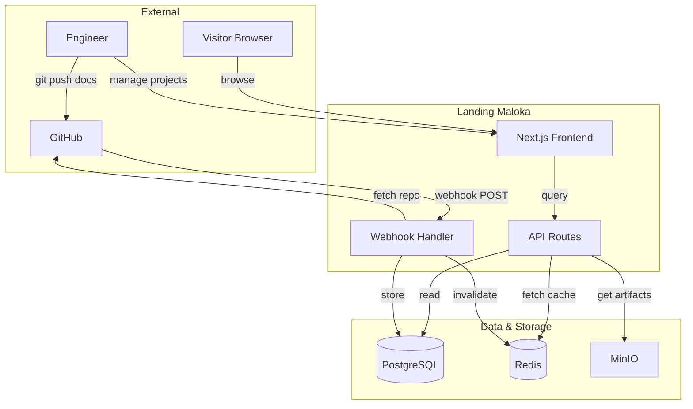
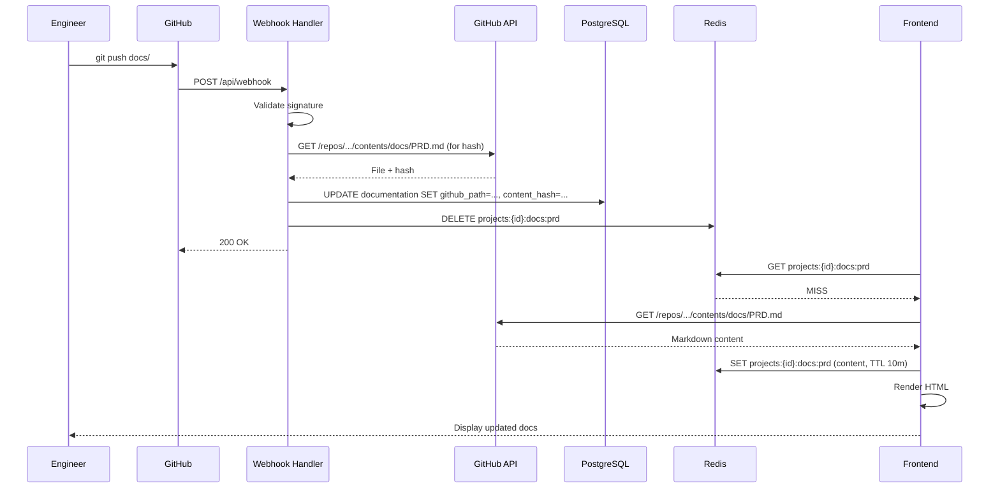

# Technical Spec: Landing Maloka — Personal Engineering Portfolio OS

| Field | Nilai |
|---|---|
| Versi | 3.0 |
| Status | Draft — Checkpoint Review (Lean MVP) |
| Tanggal | 2026-05-21 |
| Author | Claude Code Documentation Factory |
| Linked FRD | 02-FRD-landing-maloka-ecosystem-v2.0.md |


## 1. Ringkasan eksekutif

Landing Maloka MVP adalah **Modular Next.js application** — simple, pragmatic, no over-engineering. Frontend: Next.js 14 + React 18 untuk portfolio UI. Backend: Node.js API routes. GitHub webhook integration → simple fetch-and-cache untuk docs. No BullMQ, no Grafana integration, no complex queue. Just boring tech that works.

**Key principle**: Pull docs on-demand from GitHub → cache (optional Redis) → serve to visitors. Source of truth remains repository. Landing-maloka only visualizes.

**MVP caching strategy**: Start with Next.js ISR (Incremental Static Regeneration) + browser cache. Add Redis in Phase 2 if performance bottleneck identified.

---

## 2. Konteks & constraint

### 2.1 Functional drivers (dari FRD)

- Multi-project portfolio registry (7+ projects)
- Real-time doc sync via GitHub webhook
- Portfolio narrative display (storytelling)
- AI involvement tracking
- Artifact gallery
- Mobile responsive

### 2.2 Non-functional targets

| Aspek | Target |
|---|---|
| Home page load | < 2s |
| Project detail page | < 1.5s |
| Webhook processing | < 5s |
| Availability | 24/7 acceptable |
| Concurrent users | 50-100 |

### 2.3 Constraint

- **Team**: Solo engineer → low operational overhead required
- **Timeline**: 2 weeks MVP
- **Stack**: Existing Next.js, Node.js
- **Infrastructure**: Home server Docker
- **Scope**: Phase 1 portfolio + docs only (no monitoring)

---

## 3. Arsitektur tingkat tinggi



**Pattern**: Modular monolith — single Next.js codebase, clear separation (pages, API, services, lib).

---

## 4. Stack pilihan

| Layer | Pilihan | Versi | Alasan |
|---|---|---|---|
| Frontend | Next.js | 14.x | Existing, ISR for performance |
| Backend | Next.js API routes | 14.x | No separate backend needed |
| Frontend UI | React | 18.x | Existing |
| Styling | Tailwind CSS | Latest | Existing |
| Database | PostgreSQL | 16 | Existing home server, JSONB for metadata |
| Cache | Redis | 7.x | Optional Phase 2 (Next.js ISR sufficient for MVP) |
| Markdown | markdown-it | 14.x | Fast, safe, extensible |
| Markdown rendering | react-markdown | 9.x | Safe client-side rendering |
| HTTP client | axios | Latest | Webhook, GitHub API calls |
| Auth | NextAuth.js | 5.x | OAuth GitHub (Phase 2) |

**Not included in MVP**: BullMQ, Bull, event streaming, Kafka, complex queue, Grafana client, Portainer client, Redis caching (use Next.js ISR instead).

---

## 5. Komponen-komponen sistem

### 5.1 Frontend (Next.js Pages & Components)

**Tanggung jawab:**
- Project registry UI (grid/list)
- Project detail page
- Documentation viewer
- Portfolio narrative display
- Mobile responsive design

**Key files:**
```
app/
├── page.tsx                    # Home / registry
├── projects/[id]/page.tsx      # Project detail
├── api/projects/route.ts       # API handler
├── api/webhook/route.ts        # Webhook handler
├── components/
│   ├── ProjectCard.tsx
│   ├── DocumentationViewer.tsx
│   ├── PortfolioNarrative.tsx
│   └── ArtifactGallery.tsx
└── lib/
    ├── github.ts               # GitHub API fetch
    ├── markdown.ts             # Markdown utilities
    └── db.ts                   # Database queries
```

**Performance strategy:**
- ISR for project listing (revalidate: 60s)
- Dynamic rendering for project detail
- Client-side filtering/sorting
- Image optimization for gallery

### 5.2 Backend API (Next.js API Routes)

**Key endpoints:**

| Method | Path | Purpose |
|---|---|---|
| GET | /api/projects | All projects |
| GET | /api/projects/{id} | Single project |
| GET | /api/projects/{id}/docs/{type} | Documentation |
| GET | /api/projects/{id}/artifacts | Artifacts list |
| POST | /api/webhook | GitHub webhook handler |

**API response (example):**

```json
{
  "id": "rims",
  "name": "RIMS",
  "type": "WEB_APP",
  "lifecycle_state": "ACTIVE",
  "stack": { "backend": ["Laravel"], "frontend": ["Vue"] },
  "documentation": {
    "prd": { "path": "docs/PRD.md", "visibility": "PUBLIC" }
  },
  "ai_assisted": ["documentation", "architecture"],
  "ai_involvement_score": 70,
  "portfolio_narrative": "First major production...",
  "challenges": ["..."],
  "lessons_learned": ["..."],
  "innovations": ["..."],
  "last_synced": "2026-05-21T15:30:00Z",
  "sync_status": "SUCCESS"
}
```

### 5.3 GitHub Integration

**Simple webhook handler:**

1. GitHub push → webhook POST `/api/webhook`
2. Validate HMAC signature
3. Parse: repo, files changed
4. If `project.config.yaml` changed:
   - Fetch from GitHub API
   - Parse YAML → JSON
   - Store in PostgreSQL
   - Invalidate Redis cache
5. If docs/ changed:
   - Fetch file from GitHub API
   - Calculate content hash
   - Store metadata (github_path, content_hash) in PostgreSQL — actual markdown content fetched on-demand
   - Invalidate cache
6. Log sync event

**No queue, no async processing** — just fetch metadata + invalidate cache. Synchronous response within 5 seconds. Content fetched on-demand from GitHub when visitor reads docs.

**Future extensibility**: If webhook processing grows significantly in future phases (e.g., complex transformations, multi-repo orchestration), background worker extraction can be considered without refactoring the current API routes structure.

### 5.4 Database (PostgreSQL)

**Minimal schema:**

```sql
CREATE TABLE projects (
  id VARCHAR(50) PRIMARY KEY,
  config_json JSONB,              -- Full project.config.yaml
  name VARCHAR(255),
  type VARCHAR(50),               -- WEB_APP, MOBILE_APP, etc
  lifecycle_state VARCHAR(50),    -- idea, building, active, archived, experimental
  last_synced_at TIMESTAMP,
  sync_status VARCHAR(50),        -- SUCCESS, FAILED, SYNC_WARNING
  created_at TIMESTAMP,
  updated_at TIMESTAMP
);

CREATE TABLE documentation (
  id SERIAL PRIMARY KEY,
  project_id VARCHAR(50) REFERENCES projects(id),
  doc_type VARCHAR(50),           -- prd, architecture, roadmap, api, task
  github_path VARCHAR(255),       -- docs/PRD.md path in repo
  content_hash VARCHAR(255),      -- SHA hash for change detection
  visibility VARCHAR(50),         -- PUBLIC, PRIVATE
  last_synced_at TIMESTAMP,
  created_at TIMESTAMP,
  updated_at TIMESTAMP,
  UNIQUE(project_id, doc_type)
);

CREATE TABLE artifacts (
  id SERIAL PRIMARY KEY,
  project_id VARCHAR(50) REFERENCES projects(id),
  artifact_type VARCHAR(50),      -- screenshot, apk, demo
  title VARCHAR(255),
  minio_path VARCHAR(255),
  url VARCHAR(255),
  created_at TIMESTAMP
);

-- Indexes for common queries
CREATE INDEX idx_projects_type ON projects(type);
CREATE INDEX idx_projects_lifecycle ON projects(lifecycle_state);
CREATE INDEX idx_documentation_project ON documentation(project_id);
```

**Consistency model:**
- PostgreSQL acts as the local metadata registry for portfolio rendering
- Repository remains the primary source of truth for documentation content
- Landing-maloka fetches docs on-demand from GitHub (never stores content locally)

### 5.5 Cache (Redis)

**Simple cache keys:**

```
projects:list              # All projects metadata (TTL: 5m)
projects:{id}              # Single project (TTL: 5m)
projects:{id}:docs:{type}  # Documentation (TTL: 10m)
projects:{id}:artifacts    # Artifacts (TTL: 5m)
sync:status:{id}           # Last sync status (TTL: 1h)
```

**Cache strategy:**
- Cache-aside pattern (check cache, miss → fetch DB, populate)
- TTL per key (no permanent cache)
- Manual invalidation on webhook

---

## 6. Data flow — Webhook to Display



---

## 7. Failure modes & resilience

| Failure | Handling |
|---|---|
| Webhook signature invalid | Reject + log suspicious activity |
| GitHub API rate limit | Backoff, cache locally, notify engineer |
| Markdown parse error | Fallback to raw markdown + log error |
| Database down | Serve from cache (stale acceptable) |
| Redis down | Query database directly (slower but works) |
| Webhook delivery fails | GitHub retries automatically, engineer can manual retry |

**Graceful degradation:**
- Cache down → DB queries (slower but functional)
- GitHub API down → serve cached docs + "out of sync" badge
- Webhook failure → retry, manual button available

---

## 8. Deployment

### Development

```bash
# Local dev stack
docker-compose up  # Postgres, Redis, Next.js

npm run dev  # localhost:3000
```

### Production

**Docker container** (Node.js 20 Alpine):

```dockerfile
FROM node:20-alpine AS builder
WORKDIR /app
COPY package*.json ./
RUN npm ci
COPY . .
RUN npm run build

FROM node:20-alpine
WORKDIR /app
COPY --from=builder /app/.next ./.next
COPY --from=builder /app/node_modules ./node_modules
COPY --from=builder /app/package*.json ./
EXPOSE 3000
CMD ["npm", "start"]
```

**Deployment**: Docker on home server (Portainer or docker-compose), auto-deploy from GitHub Actions on main branch.

---

## 9. Logging & observability

**Structured logging** (stdout to Docker logs):
```json
{
  "timestamp": "2026-05-21T16:30:00Z",
  "level": "info",
  "event": "webhook_processed",
  "project_id": "rims",
  "status": "success",
  "duration_ms": 1200
}
```

Key events logged:
- Webhook received + validation result
- Documentation sync start/success/failure
- API request latency (duration_ms)
- Cache hit/miss
- GitHub API errors

**Note**: Metrics collection, alerting, and Grafana integration are Phase 2+.

---

## 10. Security

**MVP security model:**
- Public portfolio: all visitors have read-only access (no authentication required)
- HTTPS only (behind reverse proxy)
- HMAC webhook signature validation (GitHub webhook authenticity)
- No sensitive data in public portfolio
- CORS locked to landing-maloka origin

**Private features** (Phase 2+): GitHub OAuth login, session management — not in MVP scope.

---

## 11. Asumsi teknis

- ✅ PostgreSQL, Redis, MinIO already running on home server
- ✅ GitHub webhook endpoint reachable from internet
- ✅ GitHub OAuth credentials (for Phase 2, not MVP)
- ✅ Next.js 14 / Node.js 20 available
- ✅ Docker + reverse proxy configured

---

## 12. Open questions

- [ ] Webhook retry strategy if GitHub API fails: manual only or auto-retry? — target Week 1
- [ ] Search functionality: Phase 1 or Phase 2? — target Week 1

---

## 13. What's NOT in MVP

- ❌ BullMQ / complex job queue
- ❌ Event streaming / Kafka
- ❌ Microservices
- ❌ Grafana / Portainer integration
- ❌ Monitoring dashboard
- ❌ Alerting system
- ❌ Private dashboard
- ❌ CI/CD status display
- ❌ Deployment orchestration

---

## Document history

| Versi | Tanggal | Change |
|---|---|---|
| 1.0 | 2026-05-21 | Over-engineered with BullMQ, complex queue, Grafana |
| 2.0 | 2026-05-21 | [Intermediate] Lighter but still had monitoring |
| 3.0 | 2026-05-21 | **Lean MVP** — removed all over-engineering, simple webhook handler, on-demand doc fetching, no BullMQ, no Prometheus/Grafana metrics, simplified security/auth (Phase 2+) |
