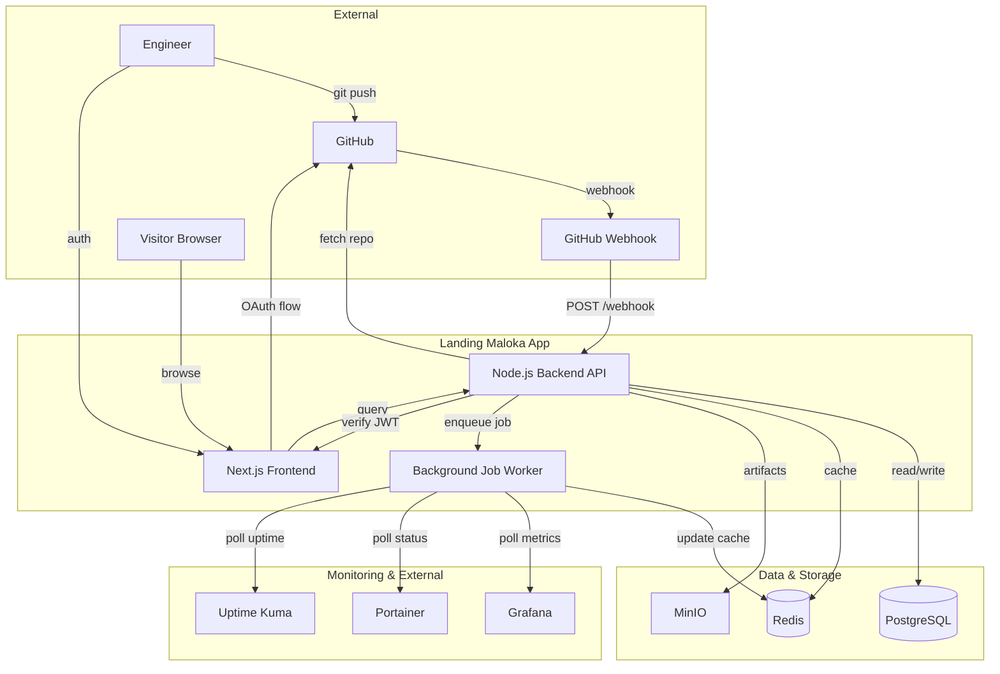
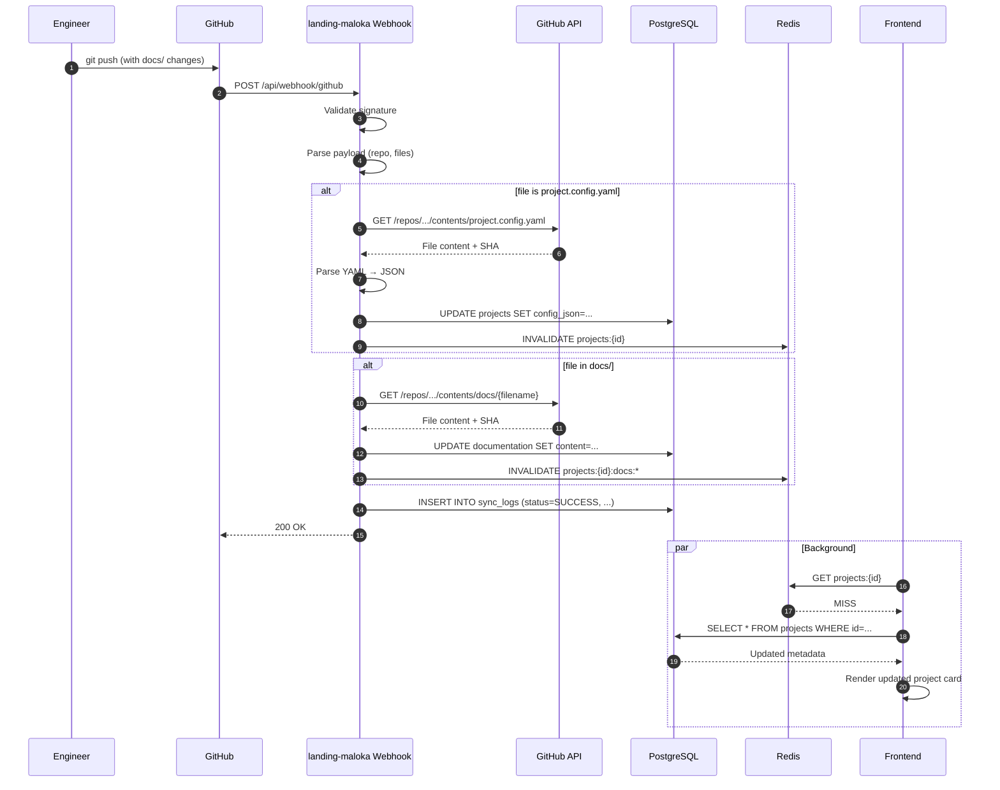
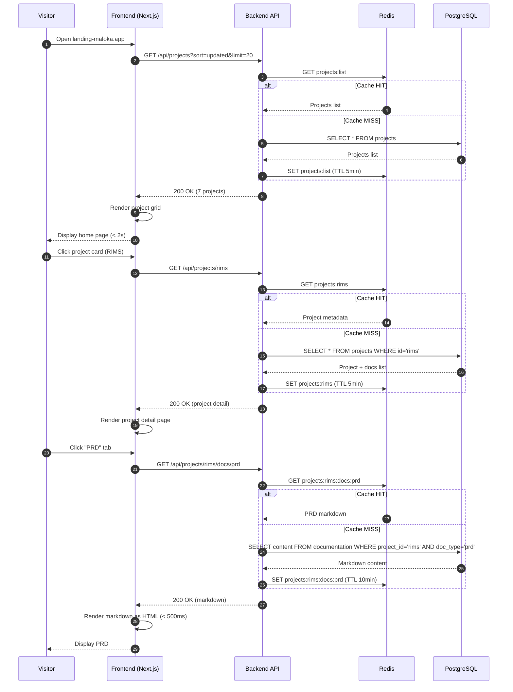

# Technical Spec: Landing Maloka — Unified Engineering Ecosystem Registry

| Field | Nilai |
|---|---|
| Versi | 1.0 |
| Status | Draft — Checkpoint Review |
| Tanggal | 2026-05-21 |
| Author | Claude Code Documentation Factory |
| Linked FRD | 02-FRD-landing-maloka-ecosystem.md |


## 1. Ringkasan eksekutif

Landing Maloka akan dibangun sebagai **Next.js monolith** (leveraging existing stack) dengan backend Node.js yang mengintegrasikan GitHub webhook, MinIO artifact storage, dan monitoring APIs (Grafana, Portainer, Uptime Kuma). Arsitektur menggunakan **pull-based architecture** untuk dokumentasi sync — GitHub push triggers webhook, backend fetches latest `project.config.yaml` & docs, cache updated, frontend invalidates. Teknologi boring dipilih (Next.js + PostgreSQL + Redis) untuk simplicity, maintainability, dan low operational overhead cocok untuk personal engineering ecosystem.

**Key trade-off**: Pull-based sync (webhook + fetch on-demand) vs push-based (event stream) — dipilih pull karena simpler untuk MVP, sufficient untuk portfolio that refreshes dalam hitungan detik, dan reduces external dependencies.

---

## 2. Konteks & constraint

### 2.1 Functional driver (dari FRD)

- Multi-project registry dengan 7+ projects, expanding ke 20+ tanpa redesign
- Real-time documentation sync dari repository via GitHub webhook
- Artifact storage untuk screenshots, APK, builds di MinIO
- Project taxonomy (8 types) & deployment taxonomy (7 types) untuk rendering logic
- Per-document visibility (public/private) untuk flexibility
- Portfolio narrative storytelling (lessons_learned, challenges, innovations)
- AI involvement tracking untuk showcasing AI-native workflow

### 2.2 Non-functional requirement

| Aspek | Target | Justifikasi |
|---|---|---|
| Home page load time | < 2s | Portfolio showcase responsiveness |
| Project detail page | < 1.5s | UI interactivity |
| Webhook processing | < 5s | Acceptable delay untuk doc sync |
| API latency p95 | < 300ms | Home server performance |
| Availability | 99.5% | Personal ecosystem, maintenance acceptable |
| Concurrent users | 50-100 | Low traffic (home server) |
| Database size (year 1) | < 10GB | Project metadata + logs only |
| Sync uptime | 99%+ | Retry logic handles failures |

### 2.3 Constraint

- **Stack existing**: Next.js (frontend already running), Node.js compatible
- **Infrastructure**: Home server (Docker-based), existing Portainer, Grafana
- **Timeline MVP**: Weeks 1-2 untuk Phase 1 core features
- **Team**: Solo engineer (low operational overhead required)
- **Storage**: Home server ~500GB available; 30-day retention acceptable
- **Security**: Personal ecosystem; OAuth GitHub acceptable

---

## 3. Arsitektur tingkat tinggi

### 3.1 Diagram konteks



### 3.2 Pattern arsitektur

**Pattern utama**: Modular monolith (Next.js full-stack)
- Single codebase: Next.js frontend + backend API (API routes)
- Single deployment: Docker container
- Modular by domain: pages/projects, api/projects, lib/github-integration, lib/markdown-parser

**Alternatif yang dipertimbangkan**:
- Microservices: ❌ Overkill untuk MVP, operational overhead too high
- Serverless (Vercel): ❌ Webhook latency issues, deployment logs access limited
- Separate frontend + backend repos: ❌ Extra deployment complexity

**Rasional**: Monolith is pragmatic untuk solo engineer + MVP timeline. Decoupled layers (pages layer, API layer, services layer, data layer) allow future extraction ke microservices jika needed.

### 3.3 Stack utama

| Layer | Pilihan | Versi | Rasional |
|---|---|---|---|
| Frontend framework | Next.js | 14.x | Existing stack, ISR untuk performance |
| Backend runtime | Node.js | 20.x | Existing, vast ecosystem |
| Frontend UI | React | 18.x | Existing, hooks for state management |
| Data layer | PostgreSQL | 16 | Relational, JSONB for flexible metadata, existing home server |
| Cache | Redis | 7.x | Fast lookup, webhook data cache, existing home server |
| Job queue | Node.js (Bull/BullMQ) | Using Redis driver | Lightweight, no extra infra |
| Artifact storage | MinIO | (existing) | S3-compatible, already running |
| Webhook library | Octokit | 20.x | GitHub SDK, type-safe |
| Markdown parser | markdown-it | 14.x | Fast, extensible, safe |
| HTTP client | axios + got | Latest | Webhooks, external API calls |
| Auth | NextAuth.js | 5.x | OAuth GitHub built-in |

---

## 4. Komponen-komponen sistem

### 4.1 Frontend (Next.js Pages & Components)

**Tanggung jawab:**
- Render project registry UI (card grid, filters, sorting)
- Display project detail page dengan metadata, docs, narrative
- Markdown rendering untuk PRD, ARCHITECTURE, etc
- Private dashboard for engineer (Phase 2)
- Authentication flow (GitHub OAuth)

**Tech stack:**
- React 18, Next.js 14 (App Router)
- Tailwind CSS untuk styling
- `react-markdown` untuk safe markdown rendering (no XSS)
- `zustand` untuk client state (filters, sort, viewport)
- `SWR` untuk data fetching + caching

**Key files structure:**
```
app/
├── page.tsx                  # Home / project registry
├── projects/
│   └── [id]/
│       └── page.tsx          # Project detail page
├── api/
│   ├── projects/             # Frontend-facing API
│   ├── webhook/
│   │   └── github.ts         # Webhook handler
│   └── auth/[...nextauth]    # OAuth GitHub
├── components/
│   ├── ProjectCard.tsx
│   ├── DocumentationViewer.tsx
│   ├── PortfolioNarrative.tsx
│   └── ...
├── lib/
│   ├── github-integration.ts # Fetch project metadata
│   ├── markdown-parser.ts    # Safe markdown rendering
│   └── database.ts           # ORM setup
└── public/
    └── projects-data.json    # Fallback cache (jika needed)
```

**Scaling strategy:**
- ISR (Incremental Static Regeneration) untuk project listing (revalidate: 60s)
- SSR untuk project detail (personalized data jika Phase 2 user-specific)
- Client-side filtering untuk type/sort (no server-side processing needed)
- Image optimization untuk screenshots gallery

### 4.2 Backend API (Node.js / Next.js API routes)

**Tanggung jawab:**
- REST API untuk project data, documentation, artifacts
- GitHub webhook handler
- Database ORM queries
- Authentication & authorization
- Cache invalidation logic

**Key endpoints (MVP):**

| Method | Path | Auth | Purpose |
|---|---|---|---|
| GET | /api/projects | None | Fetch all projects (paginated, filterable) |
| GET | /api/projects/{id} | None | Fetch single project metadata + docs list |
| GET | /api/projects/{id}/docs/{docname} | None | Fetch specific doc (PRD, ARCHITECTURE, etc) |
| GET | /api/projects/{id}/artifacts | None | List project artifacts from MinIO |
| POST | /api/webhook/github | Signature verify | GitHub webhook handler |
| GET | /api/auth/session | None | Get current user session (OAuth) |

**API response format (example):**

```json
{
  "id": "rims",
  "name": "RIMS",
  "type": "WEB_APP",
  "deployment_type": "DOCKER",
  "status": "ACTIVE",
  "lifecycle_state": "ACTIVE",
  "short_description": "Real-time Inventory Management",
  "repository": "https://github.com/...",
  "homepage": "https://rims.maloka.app",
  "stack": {
    "backend": ["Laravel", "MySQL"],
    "frontend": ["Vue.js", "Tailwind CSS"]
  },
  "documentation": {
    "prd": {
      "path": "docs/PRD.md",
      "visibility": "PUBLIC",
      "last_updated": "2026-05-21T10:00:00Z"
    }
  },
  "ai_assisted": ["documentation", "architecture"],
  "ai_involvement_score": 70,
  "portfolio_narrative": "First major production system...",
  "challenges": ["..."],
  "lessons_learned": ["..."],
  "innovations": ["..."],
  "last_synced": "2026-05-21T15:30:00Z",
  "sync_status": "SUCCESS"
}
```

### 4.3 GitHub Integration Module

**Tanggung jawab:**
- Receive & validate GitHub webhook
- Fetch `project.config.yaml` dari repository
- Fetch documentation files dari docs/ folder
- Handle retry logic kalau fetch gagal

**Tech:**
- Octokit for GitHub API
- Crypto untuk HMAC signature validation
- BullMQ for background job queue (jika async processing needed)

**Flow:**
1. GitHub push → webhook POST to `/api/webhook/github`
2. Validate webhook signature (using `GITHUB_WEBHOOK_SECRET`)
3. Parse payload: repo, branch, changed files
4. If `project.config.yaml` or docs/ changed:
   - Enqueue job: fetch-project-metadata {repo, branch}
   - Enqueue job: fetch-documentation {repo, branch, files}
5. Background worker executes jobs, updates database + cache

### 4.4 Data Layer (PostgreSQL + Redis)

**Database schema (simplified):**

```sql
-- Projects table
CREATE TABLE projects (
  id VARCHAR(50) PRIMARY KEY,  -- e.g., "rims"
  config_json JSONB NOT NULL,  -- Full project.config.yaml parsed
  type VARCHAR(20),             -- WEB_APP, MOBILE_APP, etc
  deployment_type VARCHAR(20),  -- DOCKER, STATIC, APK, etc
  status VARCHAR(20),           -- ACTIVE, ARCHIVED, BUILDING, etc
  lifecycle_state VARCHAR(20),  -- idea, building, active, archived, experimental
  repository_url VARCHAR(255),
  last_synced_at TIMESTAMP,
  sync_status VARCHAR(20),      -- SUCCESS, SYNC_WARNING, FAILED
  sync_error_message TEXT,
  created_at TIMESTAMP DEFAULT NOW(),
  updated_at TIMESTAMP DEFAULT NOW()
);

-- Documentation table
CREATE TABLE documentation (
  id SERIAL PRIMARY KEY,
  project_id VARCHAR(50) REFERENCES projects(id),
  doc_type VARCHAR(50),         -- "prd", "architecture", "roadmap", "api", "task"
  title VARCHAR(255),
  content TEXT,                 -- Markdown content
  visibility VARCHAR(20),       -- PUBLIC, PRIVATE
  last_synced_at TIMESTAMP,
  source_url VARCHAR(255),      -- GitHub raw URL
  created_at TIMESTAMP,
  updated_at TIMESTAMP,
  
  UNIQUE(project_id, doc_type)
);

-- Artifacts table
CREATE TABLE artifacts (
  id SERIAL PRIMARY KEY,
  project_id VARCHAR(50) REFERENCES projects(id),
  artifact_type VARCHAR(50),    -- screenshot, apk, demo, build, release
  title VARCHAR(255),
  minio_path VARCHAR(255),      -- Path dalam MinIO bucket
  url VARCHAR(255),             -- Public URL
  created_at TIMESTAMP,
  updated_at TIMESTAMP
);

-- Sync logs table
CREATE TABLE sync_logs (
  id SERIAL PRIMARY KEY,
  project_id VARCHAR(50) REFERENCES projects(id),
  event_type VARCHAR(50),       -- webhook, scheduled_sync, manual_retry
  status VARCHAR(20),           -- SUCCESS, FAILED, PARTIAL
  error_message TEXT,
  webhook_payload JSONB,
  created_at TIMESTAMP
);

-- Indexes
CREATE INDEX idx_projects_type ON projects(type);
CREATE INDEX idx_projects_deployment_type ON projects(deployment_type);
CREATE INDEX idx_projects_lifecycle_state ON projects(lifecycle_state);
CREATE INDEX idx_documentation_project_id ON documentation(project_id);
CREATE INDEX idx_artifacts_project_id ON artifacts(project_id);
CREATE INDEX idx_sync_logs_project_id ON sync_logs(project_id);
```

**Redis cache keys:**

```
projects:list                           # All project metadata (TTL: 5 min)
projects:{id}                           # Single project metadata (TTL: 5 min)
projects:{id}:docs:{doctype}            # Documentation content (TTL: 10 min)
projects:{id}:artifacts                 # Artifacts list (TTL: 5 min)
webhook:pending:{repo}                  # Pending webhooks queue
sync:status:{project_id}                # Last sync status (TTL: 1 hour)
```

**Consistency model:**
- **Strong consistency**: Project metadata (source of truth)
- **Eventual consistency**: Documentation content (cache miss triggers fetch from GitHub)
- **Read-after-write within session**: No special handling (cache TTL acceptable)

### 4.5 Background Job Worker

**Tanggung jawab:**
- Process async jobs: fetch metadata, fetch documentation, sync errors
- Monitoring data polling (Phase 2): Grafana, Portainer, Uptime Kuma
- Cache invalidation

**Tech**: BullMQ (Node.js job queue using Redis)

**Job types (MVP):**

| Job | Trigger | Action | Retry policy |
|---|---|---|---|
| fetch-project-metadata | Webhook | Fetch `project.config.yaml`, parse, store in DB | 3x (10s, 1m, 5m) |
| fetch-documentation | Webhook | Fetch docs/ files from GitHub, store in DB | 3x (10s, 1m, 5m) |
| validate-metadata | Scheduled daily 01:00 | Check all projects' `project.config.yaml` validity | 1x |
| cleanup-sync-logs | Scheduled weekly | Delete sync logs > 90 days old | 1x |
| cache-invalidate | On-demand | Clear Redis keys for project | 1x |

### 4.6 External Integrations

**GitHub API** (Octokit):
- `repos.getContent()` untuk fetch file
- `repos.createWebhook()` untuk setup webhook (manual setup)
- Rate limit: 5000/hour

**MinIO** (S3-compatible):
- `s3.getObject()` untuk list artifacts
- `s3.putObject()` untuk upload (Phase 2)
- `s3.getSignedUrl()` untuk public link generation

---

## 5. Keputusan arsitektur (ADR-lite)

### 5.1 Pull-based documentation sync vs push-based event stream

**Konteks**: GitHub push needs to trigger doc update in landing-maloka. Two approaches:
1. **Pull-based** (webhook → fetch on-demand)
2. **Push-based** (event stream like Kafka)

**Pilihan**: Pull-based dengan GitHub webhook.

**Alternatif ditolak:**
- Event stream: ❌ Overkill untuk MVP, adds complexity (Kafka setup, monitoring), not justified by traffic
- Scheduled sync (cron): ❌ Too slow for "realtime" requirement

**Rasional**: Webhook gives immediate trigger (< 1s latency), fetching on-demand is simpler than maintaining event bus. Acceptable for home server scale.

**Trade-off**:
- Risk: webhook delivery can fail → documents stay outdated
- Mitigation: retry logic 3x, sync status badge shows if out-of-date, manual retry button for engineer

**Revisit if**: Traffic spikes or multiple sync events queue up (then move to persistent queue + worker batching)

---

### 5.2 Monolith vs microservices for backend

**Konteks**: Landing-maloka needs backend API, GitHub integration, job processing.

**Pilihan**: Monolith (single Node.js/Next.js codebase).

**Alternatif ditolak:**
- Microservices (API service, integration service, worker service): ❌ Operational burden too high for solo engineer, deployment complexity, network latency between services not justified
- Serverless (AWS Lambda): ❌ Cold start issues for webhook handlers, limited local testing

**Rasional**: Monolith with modular layers (pages, API routes, services, workers) provides clear separation while staying pragmatic for MVP. Layers can be extracted to microservices later if demand justifies.

**Trade-off**:
- Monolith scaling: horizontal scaling easy (multiple Node processes behind load balancer)
- Operational: single deployment, simpler monitoring

---

### 5.3 PostgreSQL as primary DB vs document DB (MongoDB)

**Konteks**: Project metadata is semi-structured (`project.config.yaml` is YAML-like), but mostly has consistent schema.

**Pilihan**: PostgreSQL with JSONB column for flexible metadata.

**Alternatif ditolak:**
- MongoDB: ❌ JSONB in Postgres gives flexibility without operational burden of separate MongoDB, schema validation is simpler

**Rasional**: Postgres JSONB + structured columns = best of both worlds. Relational queries work well, and JSONB handles variability.

**Trade-off**:
- Query complexity: JSONB queries verbose compared to MongoDB → mitigate with ORM queries
- Index strategy: composite indexes on (type, deployment_type) for filtering

---

### 5.4 Redis for caching vs in-memory cache

**Konteks**: Need to cache project metadata, docs, sync status.

**Pilihan**: Redis (existing home server infrastructure).

**Alternatif ditolak:**
- In-memory cache (Node.js lru-cache): ❌ Lost on restart, no persistence, single-process limitation
- Database query only: ❌ Too slow for frequent lookups (100ms+ latency)

**Rasional**: Redis provides durability, fast lookup (< 5ms), and is already running on home server.

---

## 6. Data flow — critical paths

### 6.1 Webhook → Doc Sync Flow



### 6.2 Visitor Browse Flow



---

## 7. Failure modes & resilience

### 7.1 Failure scenarios

| Failure | Detection | Mitigation | Recovery |
|---|---|---|---|
| GitHub webhook delivery fails | Webhook retry (GitHub's automatic 25 hours retry) | None (accept delay), manual retry button for engineer | Engineer trigger manual sync |
| GitHub API rate limit | 403 error in response | Implement backoff, inform engineer in sync status | Retry after 1 hour |
| Database down | Connection timeout | Fallback to Redis-only (stale cache) until recovered | Restart DB container |
| Redis down | Connection error | Fallback to DB queries (slower) | Restart Redis |
| Markdown parsing error (malformed file) | Parse exception | Log error, use fallback (raw markdown) | Manual review + fix in repo |
| Webhook signature validation fails | HMAC mismatch | Reject webhook, log suspicious activity | Check webhook secret |
| Large documentation file (>10MB) | Size exceeded | Truncate display, show warning, store full in DB | Engineer splits file |

### 7.2 Graceful degradation

- **Cache unavailable**: Fallback to DB queries (acceptable latency < 500ms)
- **GitHub API down**: Serve cached docs (if exists), show "out of sync" badge
- **Markdown parser fails**: Show raw markdown instead of formatted
- **Webhook failure**: Queue persists in DB, engineer can manual retry
- **MinIO down**: Artifact links broken but app continues

### 7.3 Data retention & cleanup

| Data | Retention | Auto-cleanup |
|---|---|---|
| Project metadata | Indefinite | N/A (historical important) |
| Documentation content | Indefinite | N/A |
| Sync logs | 90 days | Scheduled job weekly |
| Redis cache | TTL per key (5-10 min) | Automatic expire |

---

## 8. Observability

### 8.1 Logging

**Format**: Structured JSON (Winston logger)

```json
{
  "timestamp": "2026-05-21T16:30:00Z",
  "level": "info",
  "service": "landing-maloka",
  "module": "github-integration",
  "event": "webhook_processed",
  "project_id": "rims",
  "repo": "user/rims",
  "status": "success",
  "duration_ms": 1200,
  "details": {
    "files_changed": ["docs/PRD.md", "project.config.yaml"],
    "docs_synced": ["prd", "config"]
  }
}
```

**Aggregation**: Loki (already available in Grafana stack)

**Retention**: 
- Application logs: 30 days
- Webhook logs: 30 days
- Sync logs (DB): 90 days

---

### 8.2 Metrics (Prometheus/Grafana)

**Golden signals:**

| Signal | Metric | Target | Alert threshold |
|---|---|---|---|
| Latency | `http_request_duration_ms` (p95) | < 300ms | > 500ms for 5 min |
| Traffic | `http_requests_total` | Track | N/A |
| Errors | `http_errors_total`, error rate | < 1% | > 5% for 5 min |
| Saturation | CPU, memory, DB connections | Monitor | CPU > 80% for 10 min |

**Business metrics:**

| Metric | Purpose |
|---|---|
| `projects_total` | How many projects registered |
| `webhook_delivery_success_rate` | Webhook reliability |
| `docs_sync_latency_ms` | Doc sync performance |
| `cache_hit_rate` | Cache efficiency |
| `page_load_time_ms` | Frontend performance |

### 8.3 Alerting

| Alert | Condition | Severity | Action |
|---|---|---|---|
| Webhook delivery failures | sync_status = FAILED for > 1 hour | P2 | Manual review, maybe manual retry |
| API errors spike | error_rate > 5% sustained 5 min | P1 | Page engineer for investigation |
| Database connection pool | connections > 80% | P1 | Investigate slow queries or connection leak |
| Cache miss spike | cache_hit_rate < 50% sustained 10 min | P2 | Check if memory pressure or large data change |
| Disk space | > 85% used | P2 | Log cleanup or storage expansion |

---

## 9. Security

### 9.1 Authentication & Authorization

**Public area** (no auth):
- Project registry, portfolio showcase, public docs — accessible to anyone

**Private dashboard** (Phase 2):
- GitHub OAuth login (strategy: code → access token → JWT)
- Session stored in Redis + secure HTTP-only cookie
- JWT with 24-hour expiration, refresh token for longer sessions

**API endpoints**:
- Public endpoints: no auth (no data leaks for portfolio)
- Private endpoints (monitoring Phase 2): require valid session + owner ID verification

### 9.2 Data security

- **No PII in public portfolio** (ok to show project names, stack, links, public docs)
- **Webhook signature validation** using HMAC-SHA256
- **Sensitive data filtering** in logs: strip GitHub tokens, API keys before logging
- **CORS**: Allow landing-maloka origin only for API calls
- **Rate limiting**: GitHub API rate limit + optional request rate limit per IP (Phase 2)

### 9.3 Secrets management

- **GitHub OAuth credentials** (client ID, secret): environment variables (`.env.local`)
- **Database credentials**: environment variables
- **Redis credentials**: environment variables (if auth enabled)
- **MinIO credentials**: environment variables

**Deployment**: Secrets injected via Docker environment, never committed to repo

---

## 10. Deployment topology

### 10.1 Environments

| Env | Purpose | Infra | Deployment |
|---|---|---|---|
| Development | Local development | Docker Compose (Next.js, Postgres, Redis) | Manual (localhost:3000) |
| Staging | Pre-prod testing | TBD (optional) | Manual or auto-deploy from branch |
| Production | Live | Docker container on home server | Auto-deploy from main branch via GitHub Actions |

### 10.2 Deployment unit

**Format**: Docker container (Node.js 20 + Next.js built artifacts)

**Orchestrator**: Docker on home server (managed by Portainer or docker-compose)

**CI/CD**: GitHub Actions

**Dockerfile (simplified):**

```dockerfile
# Build stage
FROM node:20-alpine AS builder
WORKDIR /app
COPY package*.json ./
RUN npm ci
COPY . .
RUN npm run build

# Runtime stage
FROM node:20-alpine
WORKDIR /app
COPY --from=builder /app/.next ./.next
COPY --from=builder /app/node_modules ./node_modules
COPY --from=builder /app/package*.json ./
EXPOSE 3000
CMD ["npm", "start"]
```

**GitHub Actions CI/CD:**

```yaml
name: Deploy to production
on:
  push:
    branches: [main]

jobs:
  build-deploy:
    runs-on: ubuntu-latest
    steps:
      - uses: actions/checkout@v3
      - uses: actions/setup-node@v3
        with:
          node-version: '20'
      
      - run: npm ci
      - run: npm run build
      - run: npm run test:ci
      
      - name: Build Docker image
        run: docker build -t landing-maloka:${{ github.sha }} .
      
      - name: Push to registry
        run: docker push registry.maloka.app/landing-maloka:${{ github.sha }}
      
      - name: Deploy to home server
        run: |
          ssh user@home-server "
            docker pull registry.maloka.app/landing-maloka:${{ github.sha }}
            docker-compose -f docker-compose.yml up -d landing-maloka
          "
```

---

## 11. Skala & kapasitas

### 11.1 Estimasi MVP (Phase 1)

- **Projects**: 7
- **Visitors/day**: < 1,000 (mostly engineer testing)
- **API RPS**: < 10 peak
- **Storage**: Project metadata ~5MB, docs ~20MB, logs ~50MB/month
- **Database size**: < 500MB
- **Cache size**: < 100MB

### 11.2 Estimasi Scale (Phase 2-3, year 1)

- **Projects**: 20+
- **Visitors/day**: < 5,000
- **API RPS**: < 50 peak
- **Storage**: Project metadata ~20MB, docs ~100MB, logs ~200MB/month
- **Database size**: < 2GB
- **Cache size**: < 500MB

**Scaling strategy**:
- Horizontal: Multiple Node.js processes behind load balancer (Nginx reverse proxy)
- Vertical: Increase Redis memory, Postgres shared buffers if query count grows
- Database: Add read replicas for monitoring queries (Phase 2+)

**No redesign needed** up to 20+ projects; architecture supports this scale natively.

---

## 12. Asumsi teknis

- ✅ GitHub OAuth application already registered (or will be during setup)
- ✅ GitHub webhook endpoint accessible from GitHub (home server behind reverse proxy)
- ✅ PostgreSQL, Redis, MinIO already running on home server
- ✅ Next.js 14 / Node.js 20 available
- ✅ Docker + Portainer available for container management
- ✅ Network connectivity: home server → GitHub API available

---

## 13. Open questions

- [ ] Should we use Vercel deployment instead of home server Docker? (Tradeoffs: webhook latency, cost, maintenance) — @engineer — target Week 1
- [ ] Database backups strategy: automated PostgreSQL dumps or managed service? — @engineer — target Week 2
- [ ] Real-time sync: should we add WebSocket for live doc refresh on frontend? (vs polling) — @engineer — target Phase 2 Week 1
- [ ] Monitoring Phase 2: should Grafana/Portainer integration be in Phase 1.5 or wait for Phase 2? — @engineer — target Week 1

---

## Document history

| Versi | Tanggal | Change |
|---|---|---|
| 1.0 | 2026-05-21 | Initial technical spec — Phase 1 MVP architecture |
